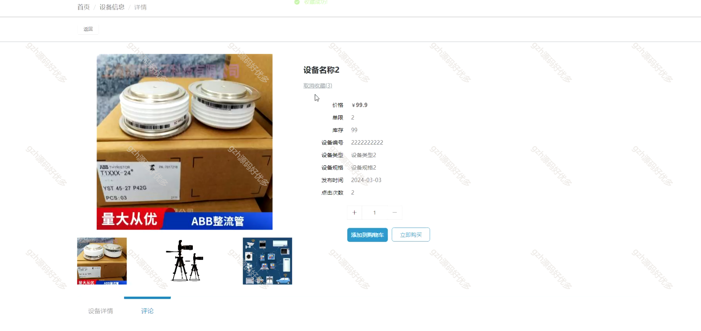
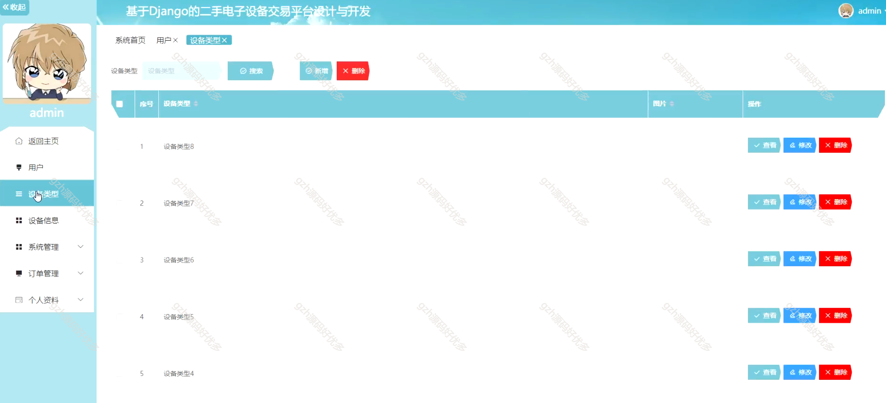

# python004
python004基于Django的二手电子设备交易平台
 
## 查看主页获取源码

### 一、关键词

闲置交易、二手物品交易、二手市场

 

### 二、作品包含

源码+数据库+设计文档万字+PPT+全套环境和工具资源+部署教程

 

### 三、项目技术

前端技术：Html、Css、Js、Vue2.0、Element-ui
后端技术：Python3.7、Django2.0

  

 

### 四、运行环境（以下版本亲测，其他版本未知，请自测）

开发工具：PyCharm + VSCODE

数据库：MySQL5.7（最低要5.7版本）

数据库管理工具：Navicat10+

Python：Python3.7

前端Nodejs：14

浏览器：谷歌浏览器

 

### 五、项目介绍

项目编号：python004

科学技术日新月异，人们的生活都发生了翻天覆地的变化，二手电子设备交易平台管理当然也不例外。过去的信息管理都使用传统的方式实行，既花费了时间，又浪费了精力。在信息如此发达的今天，我们可以通过网络这个媒介，快速的查找自己想要的信息，更加全方面的了解自己的网站信息。而且人们也可以突破传统信息管理的僵硬模式，制定属于自己的个性化的管理方案。基于现代人们的需求，设计并开发了一款二手电子设备交易平台。

该基于 Django 的二手电子设备交易平台，前台为用户提供设备信息浏览、购物车操作、个人中心（含订单等管理 ）等功能；后台管理员可进行用户、设备类型及信息、系统、订单、个人资料等全方位管理。

 

### 六、运行截图

